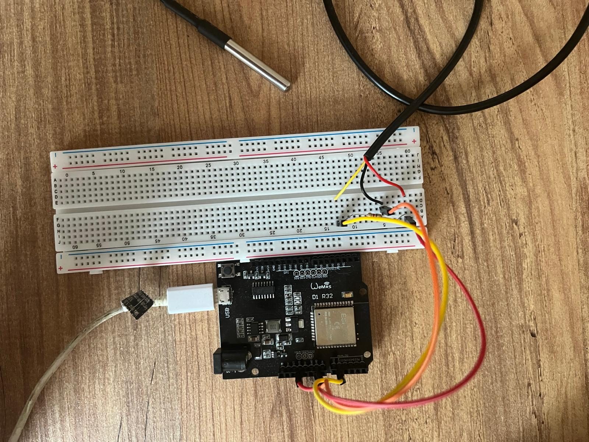

# WiFi Thermometer — Cold Room Temperature Monitor

An ESP32-based system that reads temperature from a DS18B20 sensor and uploads it to Firebase Realtime Database. It reports current temperature, historical readings, and device health (uptime, WiFi status, last upload time, etc.) to the cloud.

## Hardware

- ESP32 dev board
- DS18B20 temperature sensor (OneWire, GPIO4)



## How it works

1. On boot, the device connects to WiFi and syncs its clock via NTP.
2. It authenticates to Firebase anonymously.
3. At regular intervals it reads the temperature and writes to Firebase Realtime Database:
   - `/sogukoda/current` — current temperature (every 10s)
   - `/sogukoda/history` — timestamped historical readings (every 60s)
   - `/sogukoda/health` — uptime, WiFi/RSSI status, last upload age, reset reason (every 60s)
4. If WiFi or time sync drops, the device retries periodically to minimize data loss.
5. Cleanup of old history records is handled by a separate Cloud Functions job, not on the device.

## Setup

### 1. Prerequisites

[PlatformIO](https://platformio.org/) (VS Code extension or CLI).

### 2. Secrets (WiFi + Firebase)

WiFi and Firebase credentials are not stored in the code — they're read from `include/secrets.h`, which is excluded from the repo via `.gitignore`.

```bash
cp include/secrets.h.example include/secrets.h
```

Then fill in your own values in `include/secrets.h`:

```cpp
#define WIFI_SSID "..."
#define WIFI_PASS "..."
#define API_KEY "..."
#define DATABASE_URL "https://<project-id>-default-rtdb.firebaseio.com/"
```

`API_KEY` and `DATABASE_URL` are your Firebase project's Web API Key and Realtime Database URL.

### 3. Build and upload

```bash
pio run -t upload
pio device monitor
```

## Notes

- ESP32 only supports **2.4GHz** WiFi networks — 5GHz is not supported.
- Timing constants like `WIFI_RETRY_INTERVAL_MS` and `HEALTH_INTERVAL_MS` are defined at the top of `src/main.cpp`.
- Power-outage / prolonged-no-data alerting is handled by Cloud Functions, not on the device itself.
